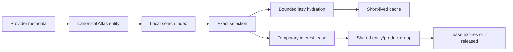

# RavenOS Atlas Universe v1

Atlas is RavenOS's broad, demand-driven market and document catalog. An object can be searchable without being live, publicly displayable, or continuously observed.

## Operator model

Atlas separates six states:

- **Cataloged** — exact metadata can be found.
- **Hydrated** — a bounded provider read has populated current detail or history.
- **Featured** — the object belongs to the small default market pulse.
- **Active** — at least one current page lease requests short-lived detail.
- **Watched or alerted** — reserved for future authenticated persistence; not implemented in this release.
- **Deep observed** — expensive options or analytical work is temporarily active. It is off by default.

Search never triggers a quote, option chain, or recurring observer. Selecting one exact result hydrates only the data needed by that detail view.

## Entity classes

Atlas never flattens unlike objects into a generic price card:

| Class | Examples | Meaning |
|---|---|---|
| Tradable quote | Equity, index, FX pair, futures contract | A provider can potentially supply a market snapshot. |
| Proxy | ETF | A tradable instrument representing an exposure; it is not the underlying market itself. |
| Reference series | FRED rate/economic series, EIA physical-market series | A periodic observation with its own units and release clock. It is not a live quote. |
| Document entity | SEC issuer or filing | Searchable filing context, never presented as a market price or complete filing summary. |

## Demand path

Options are children of an optionable underlying. Opening a stock or ETF does not fetch a chain. Opening **Options** retrieves expirations, then one selected expiration only. Closing the view allows its lease to end; no global option-contract catalog is created.

EIA route metadata and facet values remain separate from observations. An exact, bounded series request is made only after the operator chooses a provider-supported series identifier.

SEC issuer metadata is indexed separately from filing content. Opening **Filings** retrieves recent metadata and original EDGAR links. Opening **Insiders** parses bounded Form 4 ownership XML while preserving transaction time and public filing time. Atlas does not infer motive, misconduct, or causation.

## Truth and display policy

Every response carries provider, timestamp, timing class, cache state, degradation, attribution, and display-policy state. Unknown rights fail closed. A provider may resolve identity while its observation values remain unavailable on a public RavenOS origin.

Current labels mean:

- **Current-data capability** — the configured product can provide current observations; it is not a claim that an unopened catalog result was just quoted.
- **Delayed** — the provider/product clock is delayed and is labeled as such.
- **Periodic** — the source publishes on a series or release schedule.
- **Document** — a filing record with publication clocks.
- **Display restricted** — identity is usable, but values are not cleared for public display.
- **Unavailable** — identity, entitlement, rights, or provider requirements were not met. No substitute is used.

## Safety boundary

Atlas Universe v1 contains no account, balance, position, order, preview, paper-engine, signing, submission, or execution path. SnapTrade customer-account credentials and Raven's private execution systems are outside this release. Wallet/holder enrichment remains a private Raven input and is not an Atlas candle or customer portfolio authority.
