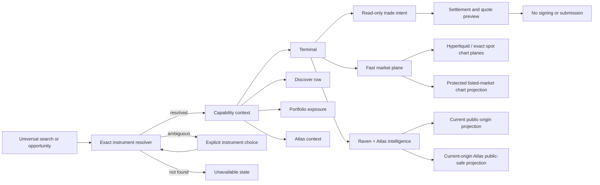
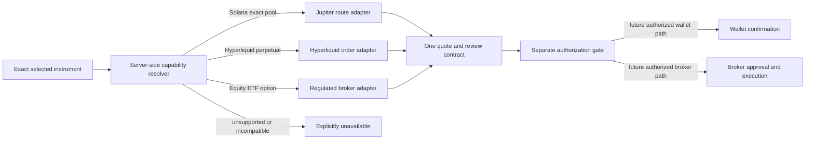

# RavenOS Cross-Market Architecture v1

Status: implementation contract, 2026-07-21
Primary code: `lib/cross_market/instrument.mjs`, `lib/cross_market/trade_intent.mjs`
Release prerequisite: `ravenos.release.v1`

## Product decision

The user chooses the market opportunity. RavenOS handles the market plumbing.

RavenOS is organized around one selected instrument, not around chain, venue, provider, or internal Raven subsystem. Search and deep links resolve an exact instrument. That identity then determines charting, market data, Raven evidence, Atlas context, account compatibility, quote behavior, custody, and settlement.

The primary application destinations are:

1. **Discover** — cross-market opportunities, movement, watch objects, and global search.
2. **Terminal** — exact instrument identity, chart, market state, Raven and Atlas intelligence, and read-only trade preparation.
3. **Portfolio** — normalized economic value, actual custody and settlement, exposure, P/L, and position context.
4. **Atlas** — deeper equity, ETF, options, event, relationship, macro, and cross-asset research.

Account and commercial settings remain utility routes. Alerts, watchlists, and Briefs are contextual objects rather than permanent primary-navigation destinations.

## Non-negotiable invariants

- No chain-first, venue-first, provider-first, or market-type-first ceremony.
- An aggregate token never masquerades as an exact pool.
- An exact instrument ID is either resolved exactly or rejected. It is never replaced by a ranked result.
- A symbol with multiple supported instruments remains ambiguous until the user selects one.
- Options retain underlying, listing/venue, expiry, strike, right, multiplier, and contract identity.
- Perpetuals retain exact venue and contract identity.
- Equities and ETFs retain listing and market-session context.
- Crypto spot intent defaults economically to USDC in and USDC out; native gas assets and route hops remain route details.
- Broker cash and securities settle as the broker actually settles them, presently USD where applicable. A portfolio conversion to USDC is display normalization, not custody.
- Public trading remains quote/review only. Signing and submission remain false in every public contract.
- Missing, stale, delayed, unsupported, and unavailable states are explicit. No stale current-opportunity substitution is permitted.

## System shape



## Canonical instrument contract

The internal public product contract is `ravenos.instrument.v1`, implemented by `normalizeInstrument()` and `validateInstrument()` in `lib/cross_market/instrument.mjs`.

Required identity fields:

| Field | Meaning |
| --- | --- |
| `instrument_id` | Stable exact identifier. Existing proven IDs are preserved. |
| `symbol` | Display symbol, not an identity by itself. |
| `asset_class` | `crypto`, `equity`, `etf`, `option`, `index`, `sector`, or `macro`. |
| `instrument_type` | `token`, `exact_pool`, `perpetual`, `equity`, `etf`, `option`, `index`, `sector`, or `macro_series`. |
| `identity_scope` | `token_aggregate`, `exact_pool`, or `exact_instrument`. |
| `venue` / `chain` | Execution or listing venue and applicable chain. Non-chain instruments use `chain=none`. |
| `market_identity` | Pool, token/contract, listing, market, or option details. |
| `underlying_instrument_id` | Required for options and other derivative contexts. |
| `base_asset`, `quote_asset` | The selected instrument's actual base and market quote identities. |
| `settlement_asset` | The venue's actual settlement or collateral identity; it is not overwritten by a portfolio display preference. |
| `preferred_cash_asset` | The default user-intent cash asset. Crypto spot defaults to USDC while brokered instruments retain USD. |
| `economic_numeraire` | Display and intent numeraire; does not change custody. |
| `chart_source` | Current chart adapter or explicit `unavailable`. |
| `market_session` | Current session state, timezone, and observation time. |
| `capabilities` | Modules that are legitimately available for this exact object. |
| `freshness` | State, observation timestamp, and source. |
| `entitlement` | Required level and whether enforcement is server-side. |
| `route_compatibility` / `account_compatibility` | Eligible quote and custody contexts. |

Existing Hyperliquid IDs such as `hyperliquid:perp:BTC` are preserved. New IDs follow deterministic type-specific forms. A pool ID includes the exact chain, venue, and pool address. An option ID includes its exact contract symbol when present, otherwise its underlying, expiry, right, and strike.

## Resolution contract

`resolveInstrumentSelection()` returns one of three states:

- `resolved`: exactly one instrument is selected;
- `ambiguous`: multiple exact instruments match a non-exact symbol/query;
- `not_found`: the requested exact ID or query is unsupported.

When `instrument_id` is supplied, the resolver performs exact equality only. It does not fall back to a symbol or a ranked opportunity. This preserves the fail-closed selected-instrument behavior already established for `/api/opportunity`.

## Capability-driven composition

The shell is persistent; modules are conditional.

Common capabilities include chart, live price, Raven intelligence, Atlas intelligence, portfolio valuation, and quote preview. Specialized capabilities include book, tape, funding, open interest, participant context, and options-chain access.

The UI must not render a grid of empty modules. For example:

- an exact token pool may expose liquidity, holders, participants, route preview, gas, and exact pool identity;
- a Hyperliquid perpetual may expose book, tape, funding, OI, pressure, margin context, and spot/perp relationships;
- an ETF may expose session state, Atlas rail context, options summary, and peer relationships;
- an option may expose contract terms and market fields only when an exact supported chain exists.

`execution=false` remains the default and current public truth.

## Trade intent and settlement

`ravenos.trade_intent.v1` represents the user's economic intent. `ravenos.settlement_preview.v1` represents a bounded quote/review result.

The intent contains the exact normalized instrument, side, amount, amount currency, preferred cash asset, requested economic output, unresolved funding/delivery custody domains, account reference, and route preference. Its only valid current state is `preview_only`. Both `execution_authorized` and `signing_authorized` are hard false.

The settlement preview may contain expected output, provider/venue label, fees, gas, price impact, slippage, actual venue settlement asset, source and destination custody domains, a material cross-domain transfer summary, and expiry. It never contains a transaction payload, signature, reservation, or broadcast result.

Default user-facing economic flows:

- crypto spot buy: `USDC -> selected exact asset market`;
- crypto spot sell: `selected exact asset market -> USDC`;
- equity/ETF/option: base display may be USDC-equivalent, but actual broker settlement remains USD;
- perpetual: actual collateral, margin, leverage, liquidation, and funding semantics remain venue-specific.

### Cash intent and cross-domain funding

USDC is the default crypto cash intent, not a claim that every USDC balance is held in one place. Solana, Base, Ethereum, and venue collateral are distinct custody domains. RavenOS resolves those domains only after an authorized account or wallet context exists.

For an available future RavenOS route, the complete path must be end-to-end:

```text
reviewed source custody
  -> any required bridge, issuer transfer, deposit, wrapping, gas, or route hops
  -> exact selected market
  -> reviewed destination custody
```

The trader should not need to leave RavenOS and operate a bridge manually when a safe end-to-end adapter is available. That convenience never hides the transfer. Review must name the source and destination domains, transfer/bridge provider, material hops, fees, gas, time/expiry, and failure or refund semantics. If those facts are incomplete, RavenOS reports `cross_domain_route_incomplete` or `cross_domain_route_not_end_to_end` and the route is unavailable.

Same-domain USDC is preferred before a cross-domain route. RavenOS never assumes that chain-local USDC balances, bridged representations, broker USD, or venue collateral are interchangeable.

## Execution adapter boundary

Execution is a capability of the exact selected instrument and compatible customer account; it is not a Terminal mode. The Terminal remains structurally identical while a server-side capability resolver selects an eligible adapter. This section is a future architecture contract only. No customer adapter, signing, submission, or confirmed-trade path is currently enabled.



The expected adapter mapping is:

| Instrument capability | Initial adapter candidate | Custody and final execution boundary | Current public state |
| --- | --- | --- | --- |
| Supported Solana exact-pool spot | Jupiter route/quote adapter | User wallet retains custody and would sign a decoded exact transaction in a separately authorized future stage | Read-only market path; no public signing |
| Supported Hyperliquid perpetual | Hyperliquid order/quote adapter | Exact venue account and Hyperliquid authorization retain collateral, margin, signing, and order semantics | Live market intelligence; no customer order path |
| Supported equity, ETF, or option | Tradier broker adapter initially | The regulated broker retains customer account, order execution, custody, and securities settlement | Atlas context only; no customer broker connection or order path |

Future providers such as additional brokers, centralized exchanges, DEX aggregators, or RFQ systems may implement the same capability-scoped boundary. Adding an adapter must not change the canonical instrument, Terminal composition, portfolio semantics, or authorization state machine.

Every future adapter must:

- accept one exact canonical instrument and reject symbol-only substitution;
- declare supported actions, account types, order types, networks, settlement assets, and freshness;
- return one provider-neutral quote/review result plus explicit provider and venue details;
- preserve actual custody, margin, settlement, approval, and fee semantics;
- resolve source and destination custody domains and expose every material cross-domain transfer in review;
- reject a route that would require the customer to discover or complete an undeclared manual bridge step;
- refuse incompatible account, region, entitlement, market-session, route, or identity state;
- never broaden a customer permission or execution flag;
- remain behind `ravenos.transaction_authorization.v1` before preparation, signing, or submission.

The user sees one intent workflow, but provider identity is not hidden at review time. “RavenOS handles the plumbing” means RavenOS resolves and explains the appropriate backend; it does not imply RavenOS is the broker, custodian, wallet, exchange, or counterparty.

## Data planes

The fast interaction plane must hydrate independently from deep intelligence:

- exact identity and capability resolution;
- chart and price;
- book/tape/funding/OI where supported;
- trade controls and quote-sheet readiness;
- portfolio summary.

Raven Reads, Atlas context, historical comparisons, cohorts, and deep Briefs may hydrate afterward. A slow narrator or Atlas provider must not block instrument switching or the chart.

## Route architecture

The target route contract is:

| Route | Role |
| --- | --- |
| `/discover/` | Primary cross-market discovery stream and universal search. |
| `/terminal/` | Selected instrument workspace. Exact identity is carried in query/context until path routing is justified. |
| `/portfolio/` | Unified read-only economic view and truthful connection state. |
| `/atlas/` | Atlas research shell with contextual tabs and deep routes. |
| `/brief/` | Contextual Raven/Atlas document opened from an instrument or event. |
| `/account/`, `/pricing/`, `/docs/` | Utility and commercial support routes. |

Legacy surfaces may redirect or remain deep compatibility routes during migration, but they do not define primary navigation.

## Current support matrix

As verified on 2026-07-22:

| Lane | Identity | Fast data | Raven context | Atlas context | Quote/execution |
| --- | --- | --- | --- | --- | --- |
| Hyperliquid perps | Exact and current | Live candles, book, tape, funding, OI | Current public-origin joins | Independent aggregate cross-market posture | Read-only; no signing |
| Solana exact pool | Exact where pool data exists | Real chart path and bounded providers | Exact Raven-native observations where covered | None yet | Existing disabled preview contracts only |
| EVM spot | Exact/aggregate varies by source | Bounded provider support | Public aggregate coverage | None yet | Read-only boundary |
| ETFs (SPY/QQQ/IWM context) | Exact verified registry IDs plus current Tradier re-verification | Searchable metadata; public values and listed candles are display-restricted pending a qualified license | No dedicated public Raven equity projection; explicitly unavailable | `/api/atlas`, universal search, filings, insiders, and exact identity implemented | No broker quote, account, signing, or execution path |
| Tradier-listed equity | Exact stock/ETF lookup with admitted exchange identity | Public quote/options/candle values withheld under the current rights decision | Explicitly unavailable unless a separate current Raven projection exists | On-demand metadata and SEC context where available | No broker quote, account, signing, or execution path |
| Option | Contract model supports exact expiry/strike/right identity | Not yet publicly projected | Not yet | Aggregate context only for selected underlyings; no public option chain | Not available |

The first polished cross-market anchor remains Hyperliquid. SPY, QQQ, IWM, and other supported U.S. listings resolve to exact identities and Atlas/SEC context, but they are not priced public anchors until a commercially qualified listed-market feed is configured. No private or diagnostic provider history is substituted.

## Release and safety relationship

All cross-market contracts ship inside `ravenos.release.v1`. `/api/build` verifies the Worker version tag, source commit, release ID, static asset digest, deploy manifest, and public-origin contract version. If those identities disagree, all API and asset requests fail with HTTP 503 before product data is served.

No browser bundle may contain provider credentials, origin tokens, private Raven paths, raw actor identities, internal thresholds, execution payloads, or signer configuration.
