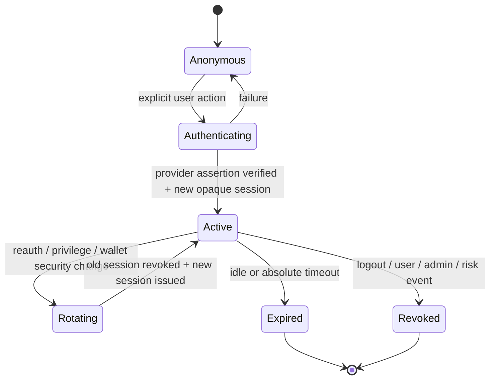

# RavenOS identity and session contract v1

Status: required design; no production implementation  
Contract: `ravenos.identity_session.v1`

## Invariants

- `user_id` is the sole RavenOS customer principal.
- Email, wallet, passkey, broker account, Stripe customer, and IdP identity are resources attached to a user; none is the user ID.
- A connected wallet is not an authenticated session.
- Authentication is delegated to a reviewed managed identity provider; RavenOS does not implement password storage.
- A valid provider assertion is not itself the browser session. RavenOS exchanges it server-side for an opaque, revocable session.
- Every authorization decision is made at a trusted server layer and denied unless explicitly allowed.
- Customer session credentials never enter browser storage or URLs.

## Identifier contracts

| Identifier | Format requirement | Exposure |
|---|---|---|
| `user_id` | `usr_` + at least 192 bits from a CSPRNG | authenticated APIs and audit records only |
| `credential_id` | `crd_` + random ID; external provider key stored separately | account security UI only |
| `session_id` | `ses_` + 256 CSPRNG bits | raw value only in secure cookie; verifier at rest |
| `session_public_id` | independent random ID | session-management UI and audit records |
| `csrf_secret` | at least 256 CSPRNG bits, session bound | same-origin request mechanism, never a URL |
| `reauth_id` | random, single-use transition ID | server-side only |

Sequential database IDs, email-derived IDs, and wallet-derived user IDs are prohibited.

## Managed identity provider acceptance gate

No provider may be integrated until it demonstrates:

- first-class WebAuthn/passkeys;
- exact RP ID and origin configuration;
- verified email recovery without email becoming the only authentication factor for protected actions;
- multiple credential/recovery methods;
- step-up authentication and recent-auth evidence;
- session and credential revocation APIs;
- device/session visibility or sufficient events to build it safely;
- signed webhooks or verified back-channel events;
- OIDC issuer/audience/nonce/state validation if OIDC is used;
- tenant isolation, production/test separation, audit export, breach process, and data-retention controls;
- no requirement to place long-lived provider bearer tokens in browser storage.

Provider identities are keyed by `(issuer, subject)`. Email is an attribute and recovery channel, not an authorization key.

## Account states

```text
pending_activation
  -> active
  -> recovery_restricted
  -> security_hold
  -> disabled
  -> deletion_pending
  -> deleted
```

Unknown or non-active states deny protected access. Disabling or deleting an account terminates all sessions and prevents new wallet/billing changes. Recovery-restricted sessions may view a bounded security screen but cannot link wallets, change billing, export portfolio data, or prepare transactions.

## Session record

Required server-side fields:

```json
{
  "schema_version": "ravenos.session.v1",
  "session_public_id": "sespub_random",
  "session_verifier": "one_way_server_verifier",
  "user_id": "usr_random",
  "created_at": "RFC3339",
  "authenticated_at": "RFC3339",
  "last_seen_at": "RFC3339",
  "idle_expires_at": "RFC3339",
  "absolute_expires_at": "RFC3339",
  "revoked_at": null,
  "revocation_reason": null,
  "authentication_methods": ["passkey"],
  "authentication_strength": "phishing_resistant",
  "credential_id": "crd_random",
  "device_label": "bounded user-visible label",
  "risk_state": "normal",
  "rotation_parent_id": null,
  "csrf_verifier": "server_side_verifier"
}
```

Do not store the raw session token, raw CSRF secret, provider token, IP address, or user agent where it is not needed. Security telemetry may retain a documented, minimized IP prefix or privacy-preserving risk signal for a bounded period.

## Cookie contract

```http
Set-Cookie: __Host-ravenos_session=<opaque>; Secure; HttpOnly; SameSite=Lax; Path=/
```

- No `Domain` attribute.
- No broad `.ravenos.xyz` scope.
- No session identifier in JavaScript, HTML, query strings, fragments, redirects, analytics, or logs.
- Authenticated responses use `Cache-Control: no-store` and prevent shared-cache storage.
- Logout invalidates server state before clearing the cookie and should clear appropriate authenticated-origin site data.

Initial limits are 30 minutes idle, 12 hours absolute, and five minutes for recent reauthentication. A session that reaches either expiry is unusable even if its cookie remains.

## Session lifecycle



The pre-authentication identifier is never promoted into the authenticated session. Authentication, reauthentication, recovery completion, role/entitlement security transitions, and wallet ownership changes rotate the session and terminate the previous token.

## Future endpoint contract

These route names are reserved design examples, not implemented APIs:

| Method and route | Purpose | Minimum protection |
|---|---|---|
| `POST /api/v1/auth/start` | begin managed authentication | anti-enumeration, rate limit, state/PKCE/nonce where applicable |
| `GET /api/v1/auth/callback` | verified provider callback | exact issuer/origin/redirect, state/PKCE/nonce, one-time code |
| `POST /api/v1/auth/reauth` | step-up ceremony | active session, CSRF, explicit action, provider recent-auth evidence |
| `GET /api/v1/sessions` | list own sessions | active session, object ownership |
| `DELETE /api/v1/sessions/:id` | revoke a session | active session, CSRF, recent reauth for other sessions |
| `POST /api/v1/logout` | revoke current session | active session, CSRF/Origin validation |
| `POST /api/v1/recovery/*` | managed recovery | enumeration resistance, one-time state, rate limits, notifications |

No endpoint accepts `user_id`, email, or wallet from the browser as proof of identity.

## CSRF and origin contract

For every cookie-authenticated state change:

1. Require a non-simple method and JSON content type unless a standards-driven callback requires otherwise.
2. Validate exact `Origin` against the authenticated application origin; use a documented Referer fallback only when Origin is absent for a legitimate browser case.
3. Validate a synchronizer token explicitly bound to the active session.
4. Validate relevant Fetch Metadata headers and reject cross-site requests by default.
5. Use an explicit CORS allowlist. Never use wildcard origins with credentials.
6. Re-run object authorization after CSRF validation; CSRF success is not authorization.

OAuth/OIDC callbacks use state, PKCE, issuer, nonce, and exact redirect validation rather than a generic CSRF token where required by the protocol.

## Authorization decision

Every protected operation evaluates:

```text
active session
AND active user
AND route/action permission
AND object ownership or explicit grant
AND field-level permission
AND current server entitlement when required
AND recent reauthentication when required
AND acceptable risk/security state
```

Failure returns a bounded public-safe error and creates a security event where appropriate. The service must not reveal whether another user's object exists.

Client-side visibility is presentation only. Cached browser claims do not grant access.

## Sensitive-transition matrix

| Operation | Recent reauth | Session rotation | Notification | Audit |
|---|---:|---:|---:|---:|
| Add/remove passkey | yes | yes | yes | yes |
| Change recovery email | yes | yes | yes, old and new channels | yes |
| Complete recovery | ceremony | yes, revoke others by policy | yes | yes |
| Link/unlink wallet | yes | yes | yes | yes |
| Change primary wallet | yes | yes | yes | yes |
| Open Billing Portal | yes | optional | yes for material change via webhook | yes |
| Connect/disconnect broker | yes | yes | yes | yes |
| Change role/entitlement administratively | strong admin auth | affected sessions reevaluated | yes | yes |
| Request future signing | yes within five minutes | no, intent is separately bound | user-visible | yes |

## Security responses

- Authentication, registration, and recovery use generic responses and comparable timing to resist enumeration.
- `401` means no acceptable session; `403` means the authenticated principal is not authorized. Object lookups may intentionally use a uniform `404` where that reduces existence disclosure.
- Never return stack traces, provider payloads, session identifiers, recovery details, internal roles, or policy thresholds.
- Rate limiting must not create a trivial malicious-account-lockout mechanism.

## Verification gate

Stage A remains blocked until automated tests prove session fixation resistance, rotation, expiry, revocation, CSRF rejection, account enumeration resistance, object-level authorization, entitlement bypass resistance, CSP behavior, and security-event redaction. The full matrix is in `docs/ravenos_security_verification_v1.md`.

Normative references: [OWASP ASVS 5.0.0](https://owasp.org/www-project-application-security-verification-standard/), [OWASP Session Management](https://cheatsheetseries.owasp.org/cheatsheets/Session_Management_Cheat_Sheet.html), [OWASP CSRF Prevention](https://cheatsheetseries.owasp.org/cheatsheets/Cross-Site_Request_Forgery_Prevention_Cheat_Sheet.html), and [W3C WebAuthn](https://www.w3.org/TR/webauthn-3/).
