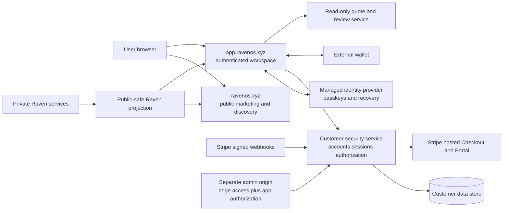

# RavenOS customer security architecture v1

Status: architecture gate, not a deployed customer system  
Version: `ravenos.customer_security_architecture.v1`  
Baseline date: 2026-07-21  
Verification baseline: OWASP ASVS 5.0.0 Level 2, with Level 3 overlays for administrative access, recovery, wallet ownership changes, billing changes, and transaction authorization.

## Decision

Customer identity and wallet security are a separate layer from Raven's existing private/public projection, release-cohesion, no-leak, and execution-safety controls.

The following are separate security principals and must never be collapsed:

1. RavenOS account: a random internal `user_id`.
2. Authentication credential: passkey, recovery method, or namespaced managed-IdP subject.
3. Server session: opaque, revocable, expiring reference to an authenticated account.
4. Wallet connection: a browser-to-wallet transport state.
5. Wallet proof: a consumed, scoped proof that a wallet controlled a private key at a specific time.
6. Wallet link: an account-owned resource created after recent account reauthentication and fresh wallet proof.
7. Entitlement: server-derived access state attached to an account.
8. Transaction authorization: a fresh authorization for one reviewed economic intent.

`wallet.connect()` proves none of account identity, wallet ownership, entitlement, resource ownership, or transaction authorization.

## Current verified state

### Controls already present

- Server-only origin secrets and protected public-origin reads.
- Current-intelligence routes fail closed rather than silently substituting stale opportunity data.
- Public no-leak validation and generated-response scanning.
- Immutable Worker/static/public-origin release identity and rollback discipline.
- Customer signing and submission flags are off.
- Current quote contracts remain read-only.

### Customer-security controls not present

- No production customer authentication or account database.
- No opaque server-side session service.
- No CSRF contract for authenticated state changes.
- No verified wallet-link registry.
- No server-enforced subscription entitlement service.
- No persistent customer Portfolio, watchlist, or alert store.
- No transaction authorization, customer signing, submission, or position monitoring.
- No dedicated authenticated application origin.

These are unavailable states, not defects to disguise with client state.

### Legacy quarantine

The source tree contains older wallet-address access and Stripe scaffolding in `ravenos-access.js`, `lib/solana_wallet_auth.mjs`, `lib/ravenos_access.mjs`, `lib/ravenos_subscriptions.mjs`, `lib/ravenos_stripe_webhooks.mjs`, and `functions/api/`. It is not an acceptable customer foundation because it lacks a RavenOS account principal, revocable session, standardized single-use wallet challenge, and object-level authorization.

The Worker now returns a fail-closed unavailable response for `/api/access` and the three `/api/stripe/*` routes regardless of legacy environment flags. Unused legacy wallet/trade client files are excluded from release assets. The source remains only as migration evidence until separately removed.

## Target trust boundaries

The public and authenticated applications should use different hostnames. The authenticated origin must not load advertising scripts, arbitrary tag managers, social widgets, or untrusted embeds. The administrative origin must add strong edge access controls, but application authorization remains mandatory.

## Customer data model

All identifiers are opaque and non-semantic.

| Object | Stable identity | Owner | Security rule |
|---|---|---|---|
| Account | `usr_` plus at least 192 CSPRNG bits | RavenOS | Never derived from email or wallet |
| Credential | managed IdP namespace + provider subject or WebAuthn credential ID | Account | Provider signatures, RP ID, origin, and ceremony validated |
| Session | `ses_` plus 256 CSPRNG bits; only a verifier is stored | Account/device | Revocable, rotated, idle and absolute expiry |
| Wallet challenge | random request ID and at least 128-bit nonce | Account session | Single use, short lived, purpose/domain/URI/chain/address bound |
| Wallet link | random `wlt_` ID | Account | Unique normalized chain/address tuple; encrypted or minimized metadata |
| Entitlement | random record ID plus account ID | Account | Derived server-side from authoritative billing events/reconciliation |
| Portfolio resource | random `prt_` ID | Account | Object-level authorization on every access |
| Trade intent | random `int_` ID and immutable canonical hash | Account + wallet | Exact reviewed fields, expiry, one-way state machine |
| Audit event | random `aud_` ID | Security system | Append-only, redacted, retention controlled |

Wallet addresses needed for customer portfolio operation must not be exported to Raven's private actor relationship graph. Raven private acquisition evidence must not be joined to customer identity.

## Authentication architecture

- Select a mature managed identity provider through a documented security review; do not build RavenOS password storage.
- Passkeys/WebAuthn are the preferred factor. Validate exact expected origins, RP ID, challenge, user presence, user verification policy, signature counter behavior where supported, and credential ownership server-side.
- Permit multiple passkeys and at least one protected recovery path. Recovery must not be weaker than enrollment.
- OIDC/social identities, if enabled, are keyed by issuer plus provider subject, never email alone.
- Authentication and recovery responses must resist account enumeration.
- High-risk changes require recent reauthentication and verified authentication strength.

WebAuthn credentials are scoped to a relying party, and the relying party must validate the client-data origin during registration and authentication. See the [W3C WebAuthn Level 3 specification](https://www.w3.org/TR/webauthn-3/).

## Session and authorization architecture

- Use opaque, server-generated, revocable sessions. Do not place bearer JWTs, refresh tokens, or session IDs in `localStorage`, `sessionStorage`, URLs, or readable JavaScript state.
- Use `__Host-ravenos_session; Secure; HttpOnly; SameSite=Lax; Path=/` with no `Domain` attribute.
- Initial policy: 30-minute idle expiry, 12-hour absolute expiry, and 5-minute recent-reauth window for sensitive changes. Risk review may tighten these values; relaxing them requires documented approval.
- Rotate and invalidate the prior session after authentication, reauthentication, recovery, privilege/role change, wallet link/unlink/primary change, and other material security transitions.
- All state-changing cookie-authenticated requests require a session-bound CSRF token, exact Origin validation, appropriate Fetch Metadata validation, and restrictive same-origin CORS behavior.
- Every protected service operation independently checks session, account state, object ownership, required entitlement, action, and recent-auth requirement. Deny by default.
- Support session inventory and individual/all-session revocation.

Relevant ASVS requirements include `v5.0.0-V3.3.1` through `V3.3.4`, `V3.5.1`, `V7.2.1`, `V7.2.3`, `V7.2.4`, `V7.3.1`, `V7.3.2`, `V7.4.1` through `V7.4.5`, `V7.5.1`, `V7.5.2`, `V8.2.1` through `V8.2.3`, and `V8.3.1`.

## Wallet architecture

- Connecting exposes only transport and selected public address state.
- Linking requires a recently reauthenticated RavenOS session and a new SIWE or SIWS-compatible server challenge.
- Challenges are single use, expire within five minutes, and bind exact application domain, URI, normalized address, chain/network, nonce, issued/expiry times, purpose, request ID, user ID, and session ID.
- Verification occurs server-side. A successful proof is consumed atomically before a link mutation can commit.
- The normalized `(wallet_family, chain_namespace, network_reference, address)` tuple is unique unless a deliberate, reauthenticated transfer procedure is completed.
- Link, unlink, primary change, and transfer create audit records and out-of-band user notification.
- Authentication messages must say plainly that they do not authorize a transaction.

EVM flows conform to [ERC-4361 Sign-In with Ethereum](https://eips.ethereum.org/EIPS/eip-4361). Solana flows conform to the Wallet Standard SIWS feature and its standardized input/output verification. Wallet linking does not create a RavenOS session.

## Billing and entitlements

- Use Stripe-hosted Checkout and Billing Portal; RavenOS does not accept card data.
- Checkout is initiated only by an authenticated, CSRF-protected account request. `client_reference_id` maps to the random RavenOS user ID, not a wallet address.
- Webhooks are verified against the untouched raw body, endpoint-specific secret, signed timestamp, and bounded tolerance before parsing or queueing.
- Event IDs are deduplicated; out-of-order events do not directly toggle access. Reconciliation retrieves authoritative subscription state from Stripe.
- Test and production webhook endpoints, products, keys, and stores are isolated.
- Entitlement writes are transactional, auditable, and immediately enforced server-side.

Stripe documents raw-body signature verification, signed timestamps, replay tolerance, and duplicate-event handling in its [webhook documentation](https://docs.stripe.com/webhooks).

## Browser and content security

Before an authenticated origin launches it must have:

- a strict CSP without `unsafe-eval` and without general `unsafe-inline` allowances;
- nonce- or hash-authorized first-party scripts;
- `object-src 'none'`, `base-uri 'none'`, and `frame-ancestors 'none'`;
- HSTS after all covered subdomains are inventoried;
- `X-Content-Type-Options: nosniff`;
- restrictive `Referrer-Policy` and `Permissions-Policy`;
- no raw-HTML rendering of Raven Reads, narrator output, Atlas content, token metadata, filings, or provider payloads;
- schema validation, bounded text length, contextual encoding, and safe URL allowlists;
- no client-accessible secrets or customer provider tokens.

Current public pages have only a partial header posture and some legacy inline scripts/styles. That is an explicit pre-Stage-A gap; it must not be described as ASVS-compliant.

## Edge security

Cloudflare WAF, managed rules, endpoint-specific rate limits, bot controls, and Turnstile may reduce abuse, but they never establish application authorization. Rate limits must consider endpoint and appropriate combinations of IP, account, session, wallet address, and failure history. Login, recovery, wallet challenge, wallet proof, quote, search, checkout, and webhook endpoints receive distinct policies.

Cloudflare documents rate-limiting rules for login and API abuse in its [WAF rate-limiting documentation](https://developers.cloudflare.com/waf/rate-limiting-rules/). Every edge policy needs an exported configuration artifact, isolated test, rollback, and an application-side limit where bypass would be material.

## Broker and portfolio security

- Customer brokerage credentials are separate from Raven's internal Tradier market-data credential.
- Customer OAuth refresh tokens remain server-side, encrypted with managed key material, minimally scoped, revocable, and excluded from logs and browser responses.
- Start with read-only scopes. Trading permissions require a later authorization milestone.
- Portfolio resources use random IDs and object-level authorization; wallet address or account ID from a request never establishes ownership by itself.
- Normalized economic views do not change actual custody or settlement facts.
- A unified USDC cash intent does not collapse chain-local balances or authorize a bridge. Cross-domain funding requires an exact, end-to-end, separately reviewed route; incomplete or hidden transfer state fails closed.

## Audit and notification

Record structured events for account creation, authentication outcomes, credential changes, recovery, session revocation, wallet changes, billing/entitlement changes, broker connections, quote/intent changes, signing requests, submission, role changes, and administrative actions.

Never log session tokens, CSRF secrets, passkey private material, recovery codes, wallet signatures beyond a strictly justified bounded verification record, Stripe secrets, broker tokens, private keys, seed phrases, transaction signer material, or raw sensitive provider payloads. Correlation identifiers must be non-secret or one-way derived.

## Staged gates

| Stage | Capability | Required gate |
|---|---|---|
| A | Accounts and passkeys | Managed IdP review, session store, CSRF, object authorization, recovery, CSP, ASVS test evidence |
| B | Verified wallets and read-only portfolio | SIWE/SIWS challenge service, uniqueness, recent reauth, notifications, privacy review |
| C | Persistence and subscriptions | Watchlist/alert ownership, hosted Stripe flows, verified/reconciled entitlements |
| D | Quote and order review | Immutable intent binding, route decoding, simulation, expiry, mismatch tests; still no submission |
| E | Public signing/submission | Dedicated execution threat model, external penetration and transaction review, incident runbook, explicit owner authorization |

No later stage may bypass an earlier stage. Public execution remains disabled.

## Authority and references

- [OWASP ASVS 5.0.0](https://owasp.org/www-project-application-security-verification-standard/)
- [OWASP session management guidance](https://cheatsheetseries.owasp.org/cheatsheets/Session_Management_Cheat_Sheet.html)
- [OWASP CSRF prevention guidance](https://cheatsheetseries.owasp.org/cheatsheets/Cross-Site_Request_Forgery_Prevention_Cheat_Sheet.html)
- [OWASP XSS prevention guidance](https://cheatsheetseries.owasp.org/cheatsheets/Cross_Site_Scripting_Prevention_Cheat_Sheet.html)
- [OWASP CSP guidance](https://cheatsheetseries.owasp.org/cheatsheets/Content_Security_Policy_Cheat_Sheet.html)
- [W3C WebAuthn](https://www.w3.org/TR/webauthn-3/)
- [ERC-4361](https://eips.ethereum.org/EIPS/eip-4361)
- [Stripe webhooks](https://docs.stripe.com/webhooks)

This document is a design contract, not a certification claim. Verification status lives in `config/customer_security.json` and `docs/ravenos_security_verification_v1.md`.
