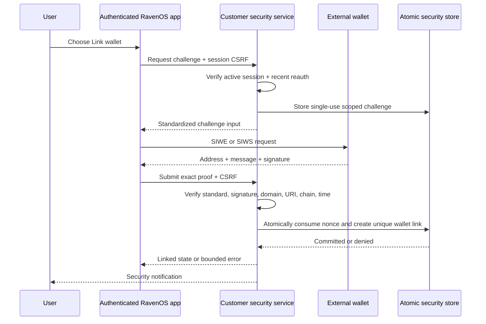

# RavenOS wallet linking contract v1

Status: required design; wallet linking is not implemented  
Contract: `ravenos.wallet_linking.v1`

## Separate user-visible states

RavenOS must display these states independently:

| State | Meaning | Does not mean |
|---|---|---|
| Wallet connected | Browser can communicate with a wallet and read its selected public address | signed in, verified, linked, entitled |
| Wallet verified | One fresh challenge was signed and verified for the declared address/network/purpose | linked permanently, transaction authorized |
| Signed in | A RavenOS account has an active server-side session | any wallet is connected or linked |
| Wallet linked | A verified wallet resource belongs to the current account | signing or submission is permitted |
| Awaiting wallet confirmation | A separately reviewed transaction is being presented by the wallet | signed, submitted, or confirmed |

Disconnecting a wallet transport does not log out the RavenOS account. Logging out does not claim that an external wallet disconnected itself.

## Required principals

- `user_id`: random RavenOS account ID.
- `session_public_id`: active RavenOS session reference.
- `wallet_link_id`: random RavenOS resource ID.
- `wallet_family`: `evm` or `solana` initially.
- `network_namespace` and `network_reference`: CAIP-compatible chain/network identity where practical.
- `normalized_address`: chain-canonical address representation.
- `challenge_id`: random server identifier.
- `nonce`: at least 128 bits of CSPRNG entropy, encoded compatibly with the selected standard.

Neither address nor ENS/SNS name becomes `user_id`.

## Challenge record

The server creates and stores a one-time record before requesting any signature:

```json
{
  "schema_version": "ravenos.wallet_challenge.v1",
  "challenge_id": "wch_random",
  "purpose": "link_wallet",
  "user_id": "usr_random",
  "session_public_id": "sespub_random",
  "wallet_family": "evm",
  "network_namespace": "eip155",
  "network_reference": "8453",
  "normalized_address": "0x...",
  "domain": "app.ravenos.xyz",
  "uri": "https://app.ravenos.xyz/account/wallets",
  "nonce_verifier": "one_way_server_verifier",
  "issued_at": "RFC3339",
  "expires_at": "RFC3339 no more than five minutes later",
  "consumed_at": null,
  "request_id": "wreq_random",
  "reauthenticated_at": "RFC3339 within five minutes"
}
```

The challenge store must support atomic consume-if-unused-and-unexpired behavior. A successful signature verification without successful consumption does not authorize a link.

## EVM proof

Use [ERC-4361 Sign-In with Ethereum](https://eips.ethereum.org/EIPS/eip-4361) message formatting and verification. Required fields include exact domain, address, URI, version, EIP-155 chain ID, nonce, issued time, expiration time, request ID, and a human-readable statement.

RavenOS link statement:

```text
Link this wallet to your RavenOS account. This proves control of the address and does not authorize a transaction.
```

Server verification must:

1. parse the message according to ERC-4361 rather than regexing arbitrary text;
2. require exact expected scheme/domain and exact allowed URI;
3. require exact normalized address and requested chain ID;
4. require nonce, request ID, issued time, and expiry to match the stored challenge;
5. reject not-yet-valid, expired, malformed, altered, or already consumed requests;
6. validate the signature for the declared account, including an explicitly reviewed contract-wallet path if ERC-1271 support is enabled;
7. consume the challenge atomically before link mutation;
8. re-check session, user, recent-auth status, and wallet uniqueness in the same controlled operation.

Unsupported contract-wallet or chain behavior fails closed; RavenOS must not silently fall back to an EOA assumption.

## Solana proof

Use the [Wallet Standard Sign-In With Solana specification](https://github.com/phantom/sign-in-with-solana) and supported wallet `signIn` feature. Construct the standardized input with domain, address, statement, URI, version, chain/network identifier where supported, nonce, issued time, expiration time, and request ID.

RavenOS link statement:

```text
Link this wallet to your RavenOS account. This proves control of the address and does not authorize a transaction.
```

The server verifies the returned address, signed message bytes, and Ed25519 signature against the exact stored challenge. A generic reusable message such as `RavenOS account access / Wallet / Origin` is prohibited because it lacks nonce, expiry, request, chain, and single-use semantics.

If a wallet does not support the selected standardized flow, RavenOS may show it as unsupported. It must not downgrade silently to an opaque signature prompt.

## Link flow



No RavenOS session is created by this flow. The existing session rotates after a successful ownership change.

## Link registry

Required fields:

```json
{
  "schema_version": "ravenos.wallet_link.v1",
  "wallet_link_id": "wlt_random",
  "user_id": "usr_random",
  "wallet_family": "solana",
  "network_namespace": "solana",
  "network_reference": "mainnet",
  "normalized_address": "base58_public_key",
  "label": "bounded user label",
  "status": "active",
  "is_primary": false,
  "verified_at": "RFC3339",
  "created_at": "RFC3339",
  "revoked_at": null,
  "last_proof_challenge_id": "wch_random"
}
```

The normalized family/network/address tuple has a uniqueness constraint across active links. Public-address storage must be access-controlled, minimized, and excluded from public responses, client analytics, and Raven private actor graphs.

## Duplicate and transfer behavior

If a wallet is already linked to another account, the normal link request returns a generic conflict without identifying the other account. Support cannot move it based solely on email.

A future transfer flow requires:

- recent strong reauthentication on the destination account;
- fresh proof from the wallet;
- additional proof or a documented high-assurance recovery process for the source account;
- explicit confirmation and delay where risk warrants;
- revocation of affected sessions as policy requires;
- audit and notification to both accounts' verified channels.

No automated silent transfer is permitted.

## Unlink and primary-wallet changes

Both require an active session, session-bound CSRF protection, recent reauthentication, explicit object ownership, and confirmation. The service must prevent a user from removing their last recovery factor because wallets are not recovery factors. A wallet may be unlinked even if it is disconnected, because link ownership is server state.

Every successful change rotates the session and emits a notification. Suspicious or failed attempts create redacted security events.

## Read-only portfolio use

Stage B may use a linked public address for read-only public-chain balance and position reads. It does not grant transaction signing. The portfolio service accepts a `wallet_link_id`, verifies ownership server-side, resolves the address internally, and never authorizes based on an address supplied directly by the client.

Wallet addresses and balances are customer data. They are not sent to public Raven projections, narrator prompts, marketing analytics, or Raven's private wallet relationship system.

## Required failure cases

- wrong domain, URI, chain/network, address, request ID, nonce, or purpose;
- expired, not-yet-valid, already consumed, unknown, malformed, or oversized challenge;
- invalid signature or unsupported contract-wallet verification;
- inactive/revoked session, wrong user, missing CSRF, or stale recent-auth evidence;
- wallet already linked, racing duplicate submissions, or link state changed concurrently;
- signature produced for a transaction-shaped or opaque message.

All fail closed. Error text must not disclose account existence or another account's identity.

## Rollout gate

Wallet linking stays unavailable until every `SEC-WAL-*` scenario in `config/customer_security.json` has implemented automated coverage, a privacy review confirms separation from Raven actor evidence, and Stage A account/session controls are verified.
